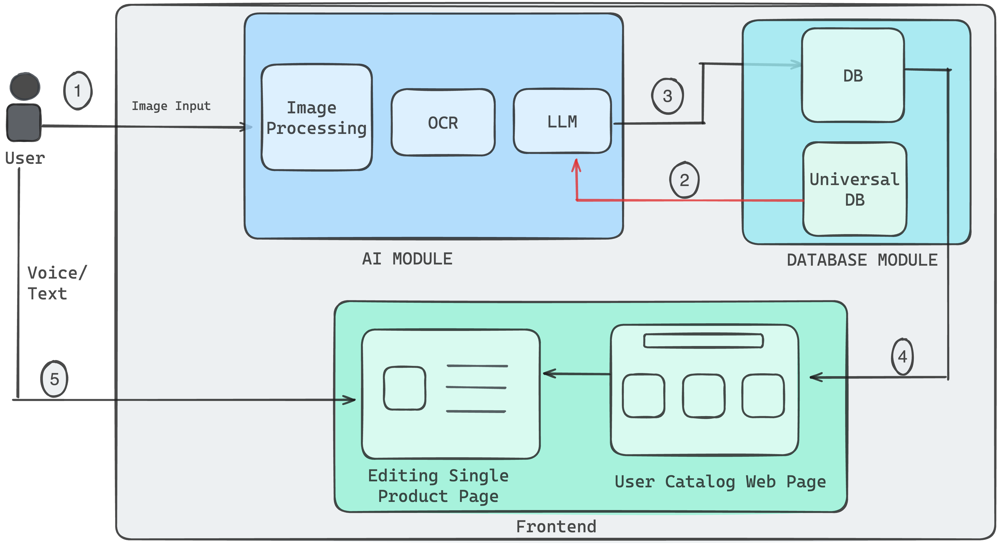

# Catalog Digitization - BUILD FOR BHARAT Hackathon 2024

## Introduction
This project aims to revolutionize how product catalogs are digitized, leveraging cutting-edge technologies to enhance the user experience for sellers. Our solution seamlessly digitizes catalogs with 1000+ SKUs, incorporating attributes like SKU id, product name, description, price, image, inventory, color, size, and brand, using a combination of intuitive interfaces including text, voice, and image inputs in Indic languages.

## Architecture
Our architecture combines OCR technology with a sophisticated large language model to extract and process data from images, pre-filling product information from an existing repository. The backend, built with Django, manages data operations and interfaces, ensuring a smooth digitization process.



## Features
- **Intuitive Interfaces**: Use of text, voice, and image inputs for catalog digitization.
- **Multilingual Support**: Incorporates Indic languages for text and voice inputs.
- **OCR Integration**: Extracts data from images to streamline the digitization process.
- **Database Management**: Efficiently stores and retrieves catalog data, with checks against a primary database to avoid duplicates.

## Getting Started

```
pip install -r requirements.txt
python manage.py makemigrations
python manage.py migrate
python manage.py runserver
```

## Pages

1. Catalog Page - All the Digitiliazed Catalogs will be displayed here.
2. Upload Image - User can upload the image of a product and the details will be extracted using OCR & LLM
3. Add Product - User can add the product details and update it to the database.

## Technologies Used

- **Django**: Backend framework for managing data operations and interfaces.
- **Tesseract OCR & Easy OCR & AZURE OCR**: Extracts text from images for digitization.
- **LLAMA 7B & GPT 3.5**: Large language model for processing text and voice inputs.
- **Speech Recognition**: Converts voice inputs to text for digitization.